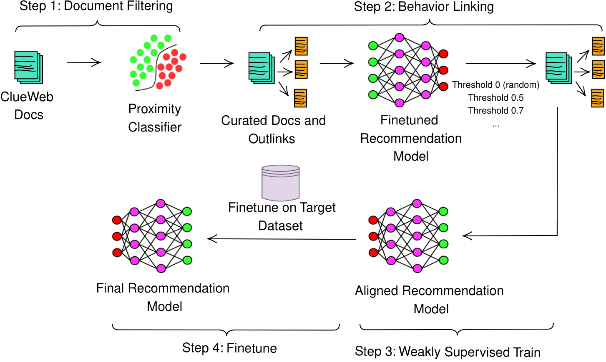

# Weakly Supervised Domain Adaptation for Sequential Recommendation Systems

Large language models (LLMs) have shown strong performance across many language tasks, which has motivated growing interest in applying them to recommendation systems. However, directly transferring LLMs from their original web-scale pretraining corpora to recommendation tasks remains challenging. A major reason is the **domain gap** between open-domain web text and recommendation data, where user-item interaction patterns and item semantics are task-specific.

This challenge becomes even more severe when the target recommendation dataset is **small** and **highly sparse**. In such settings, standard finetuning alone is often insufficient for effectively adapting an LLM-based recommender to the target domain.

To address this problem, we propose a **weakly supervised domain adaptation framework** for **LLM-based recommendation systems**. Our framework constructs a recommendation-oriented intermediate training dataset from web corpora and uses it to adapt the model before standard finetuning on the target recommendation data.

The framework consists of three stages:

1. **Document Filtering**  
   We first identify recommendation-relevant documents from large-scale web corpora.

2. **Behavior Linking**  
   We then pair each curated document with its outlink document to form weakly supervised training pairs that mimic sequential or related-consumption behavior.

3. **Weakly Supervised Training**  
   The LLM-based recommendation model is trained on the constructed weakly supervised dataset, followed by standard finetuning on the target recommendation dataset.

In this work, we use **ClueWeb** for dataset construction and adopt **HLLM**, a state-of-the-art LLM-based recommendation model, as the backbone. Experiments on **PixelRec200K (5% users)** and **Microlens-100K (15% users)** show that the proposed framework improves recommendation performance in limited-data and highly sparse settings.

---

## Overview

This repository contains code for weakly supervised adaptation of LLM-based recommendation models.

The core idea is to bridge the gap between:
- **web-domain pretraining data**, where general-purpose LLMs are learned, and
- **recommendation-domain interaction data**, where recommendation models are deployed.

Instead of relying only on sparse target-domain user behavior, this project constructs a weakly supervised training signal from web data and uses it to better align LLM representations with recommendation tasks.

---

## Key Contributions

- Proposes a **weakly supervised training pipeline** for adapting LLMs to recommendation systems.
- Introduces a **Document Filtering** stage to curate recommendation-related web documents.
- Introduces a **Behavior Linking** stage that uses document–outlink pairs as weak supervision.
- Supports **LLM-based sequential recommendation backbones**, with **HLLM** as the primary model in this work.
- Demonstrates effectiveness on **small-scale, highly sparse recommendation datasets**.

---

## Model Highlights

- Uses separate modeling components for:
  - **item-level textual representation learning**
  - **user-level sequence modeling**
- Supports **contrastive learning / NCE-style training** for retrieval and ranking.
- Can leverage **pretrained LLM weights** for stronger initialization.
- Supports **Deepspeed-based distributed training** for memory efficiency.

---

## Repository Structure

```bash
.
├── code/                 # Core codebase for data processing, training, and evaluation
├── dataset/              # Processed interaction data
├── information/          # Item textual information
├── overall/              # Global training configs
├── HLLM/                 # HLLM model configs
├── IDNet/                # ID-based baseline configs
├── reproduce/            # Scripts for reproducing experiments
├── design/               # Figures and diagrams
└── README.md


```

## Experimental Setting

This project focuses on **limited-size** and **high-sparsity** recommendation scenarios, where direct finetuning of LLM-based recommendation models is often insufficient.

The main experimental backbones and resources used in the paper include:

- **ClueWeb** for weakly supervised dataset construction
- **HLLM** as the LLM-based recommendation backbone
- **PixelRec200K (5% users)**
- **Microlens-100K (15% users)**

---

## Design Illustration



---

## Acknowledgements

This repository builds on ideas and code from prior work in recommendation systems and LLM-based modeling, including projects such as:

- RecBole
- PixelRec
- HSTU
- related open-source recommendation repositories

We thank the corresponding authors and open-source contributors for their valuable efforts.

---

## License

This repository is released under the **Apache License 2.0**.

Please also verify the licenses of any third-party datasets, pretrained weights, and external resources before use.